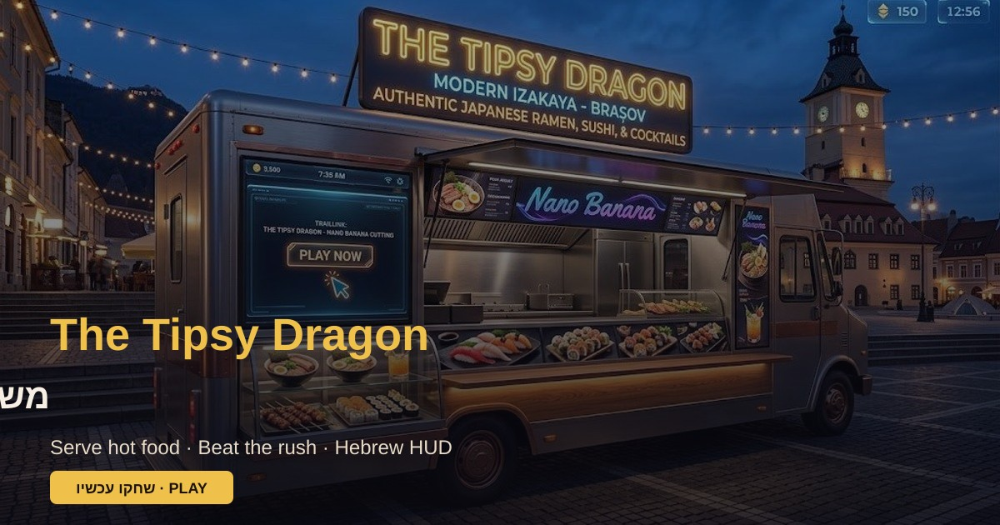

# The Tipsy Dragon 🐉

משחק תגובה בעברית: אתם מפעילים בר בתוך פוד־טרק (משקאות + גלידות + ארטיקים + אוכל חם).
מצב **אינסופי** — שלבים שהולכים ונהיים קשים יותר עד שנגמרים החיים.

ריפו עצמאי, חולץ מתוך [TrailLink](https://github.com/maduel-cmd/TrailLink) (`apps/foodtruck-bar`).

## Live

- https://traillink-foodtruck-bar.netlify.app
- https://tipsy-dragon.netlify.app

## הרצה

```bash
npm install
npm run dev
```

פותחים: http://127.0.0.1:5180

בנייה:

```bash
npm run build
```

## QA / שער מקומי

```bash
npm test                 # unit + asset/env/animation/iphone CSS asserts
npm run qa:assets        # קטלוג ↔ דיסק + anti-placeholder
npm run qa:environments  # 6 סביבות + אייקונים + mobile
npm run qa:animations    # CSS motion / reduced-motion
npm run qa:iphone        # iPhone SE + 14/15: no document scroll (needs build/preview)
npm run typecheck
npm run build
```

> **Live Netlify:** `qa:live` HEAD checks production. The iPhone viewport-fit layout is on this PR branch until Rotem approves a Netlify deploy — use local `qa:iphone` / preview for visual confirm until then.

בדיקת HEAD מול פרוד (אופציונלי, דורש רשת):

```bash
QA_LIVE_URL=https://traillink-foodtruck-bar.netlify.app npm run qa:live
# או
QA_LIVE_URL=https://tipsy-dragon.netlify.app npm run qa:assets
```

Playwright E2E (דורש `@playwright/test` + שרת רץ / URL חי):

```bash
PLAYWRIGHT_BASE_URL=http://127.0.0.1:5180 npm run qa:environments:e2e
PLAYWRIGHT_BASE_URL=http://127.0.0.1:5180 npm run qa:animations:e2e
```

תיעוד צינור אמנות: [`docs/ASSET_PIPELINE_FOODTRUCK_he.md`](docs/ASSET_PIPELINE_FOODTRUCK_he.md) · [`docs/ASSETS_TIPSY_DRAGON_he.md`](docs/ASSETS_TIPSY_DRAGON_he.md)

## פרומו / Store listing

צילומים ממותגים: [`docs/promo/`](docs/promo/) (וגם `public/promo/` בבילד) · `og:image` = `/promo/og.jpg`

| | עברית | English |
| --- | --- | --- |
| **שם** | הדרקון השיכור · משאית האוכל | The Tipsy Dragon |
| **סוג** | טייקון משאית אוכל — הכנה, הגשה, סביבות שטח | Food-truck bar tycoon — prep, serve, field environments |
| **מה מיוחד** | תפריט photoreal, HUD בעברית, 6 סביבות (קרקס עד פסטיבל), PWA אופליין, מגע גדול לשטח | Photoreal menu, Hebrew HUD, six field environments, offline PWA, touch-first |
| **קצר לחנות** | הגישו מנות חמות ממשאית האוכל לפני שהלקוחות בורחים. שיאי שלב אינסופיים. | Serve hot plates from your food truck before customers bail. Endless stage highs. |



## פריסה ל-Netlify

מוגדר דרך `netlify.toml`: `npm run build`, publish `dist`, Node 22.

> Deploy / merge לפרוד — רק אחרי אישור מפורש.

בטלפון: פתחו את הקישור → שתפו / «הוסף למסך הבית» (PWA).

## איך משחקים

1. בחרו סביבה ותחנת עבודה (אופציונלי).
2. לחצו על לקוח בתור כדי לבחור הזמנה.
3. לחצו מוצרים מהמדף עד שהמגש תואם — ואז **הגישו**.
4. שלבים מוקדמים נוחים למתחילים; אחר כך קבוצות גדולות יותר ופחות זמן.
5. הלילה נגמר רק כשנגמרים החיים — נסו לשבור שיא שלב.

### שטח / מובייל

- **מצב שמש** — ניגודיות גבוהה לקריאה באור חזק
- **אופליין** — Service Worker + שבב סטטוס רשת
- **יעדי מגע גדולים** + זוהר ללקוח דחוף
- **טיפים קצרים** במקום מדריך ארוך

פירוט: [`docs/GEMINI_FIELD_UX_he.md`](docs/GEMINI_FIELD_UX_he.md)

## מבנה

- `src/game/catalog.ts` — קטלוג מוצרים (כולל אוכל חם)
- `src/config/environments.ts` — 6 סביבות + אייקונים + mobile WebP
- `src/game/waves.ts` — `getStageConfig` לשלבים אינסופיים מתגברים
- `src/game/progress.ts`, `sfx.ts`, `moodLines.ts`, `fieldUx.ts` — התקדמות, סאונד, מצב־רוח, UX שטח
- `src/components/PwaUpdateBanner.tsx` — עדכון PWA
- `public/assets/` — אמנות חיה (environments, items, characters; UI sprites מינימליים)
- `archive/legacy-sprites/` — לוחות ישנים מחוץ לבילד
- `public/promo/` — פרומו + og:image
- `src/App.tsx` — לולאת המשחק
